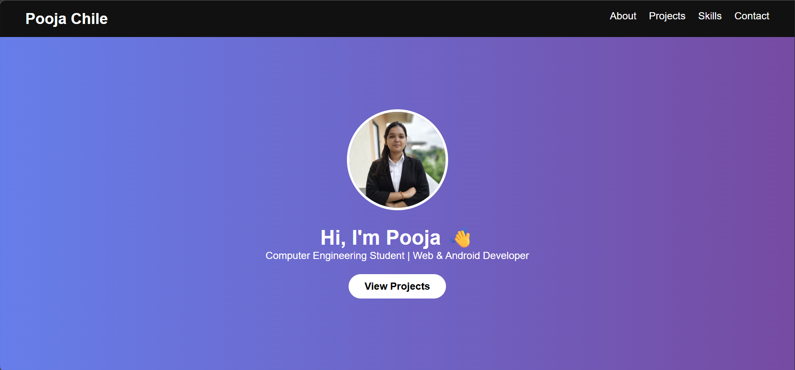
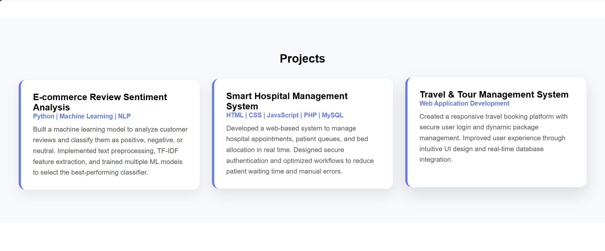

# Assignment 2 - Personal Portfolio Website

## Overview

A modern, responsive personal portfolio website built with React, showcasing professional skills, projects, and achievements. This assignment demonstrates advanced React development, responsive design, and professional web development practices.

## Features

###  Navigation
- **Smooth Scrolling Navigation** - Seamless navigation between sections
- **Responsive Navbar** - Mobile-friendly collapsible menu
- **Active Section Highlighting** - Visual feedback for current section

### Hero Section
- **Professional Profile Image** - Personal branding with profile photo
- **Compelling Introduction** - Clear value proposition and role description
- **Call-to-Action Button** - Direct navigation to projects section

### About Section
- **Personal Background** - Computer Engineering student profile
- **Technical Foundation** - Data Structures, Algorithms, and CS concepts
- **Development Experience** - Web, Android, and database development
- **Learning Philosophy** - Emphasis on continuous improvement and collaboration

### Projects Showcase
Three featured projects demonstrating diverse technical skills:

#### 1. E-commerce Review Sentiment Analysis
- **Technologies**: Python, Machine Learning, NLP
- **Features**: Text preprocessing, TF-IDF feature extraction, ML model training
- **Impact**: Automated sentiment classification for customer reviews

#### 2. Smart Hospital Management System
- **Technologies**: HTML, CSS, JavaScript, PHP, MySQL
- **Features**: Real-time appointment management, patient queues, bed allocation
- **Impact**: Reduced waiting times and manual errors

#### 3. Travel & Tour Management System
- **Technologies**: Web Application Development
- **Features**: Responsive booking platform, secure authentication, dynamic packages
- **Impact**: Improved user experience with intuitive UI design

### Skills Section
**Technical Skills**:
- **C++** - Programming fundamentals and data structures
- **JavaScript** - Frontend and backend development
- **React** - Modern web application development
- **Firebase** - Backend services and real-time databases
- **SQL** - Database design and management
- **Android (Kotlin)** - Mobile application development

###  Contact Section
- **Professional Communication** - Multiple contact channels
- **Social Media Integration** - Professional online presence
- **Direct Engagement** - Easy access for collaboration opportunities

## Technologies Used

### Core Framework
- **React 19.2.4** - Latest React version for modern development
- **React DOM** - Web rendering capabilities

### Development Tools
- **Create React App** - Zero-configuration React application setup
- **React Scripts 5.0.1** - Build and development scripts
- **Web Vitals** - Performance monitoring and metrics

### Testing Suite
- **React Testing Library** - Component testing utilities
- **Jest** - JavaScript testing framework
- **User Event** - Realistic user interaction testing
- **Testing Library DOM** - DOM testing helpers

### Deployment & Hosting
- **GitHub Pages** - Free hosting for static websites
- **gh-pages** - Automated deployment package

## Project Structure

```
Assignment-2/
├── Outputs/                  # Screenshots and outputs
│   ├── 1.png                # Portfolio screenshot 1
│   └── 2.png                # Portfolio screenshot 2
├── portfolio/               # React application
│   ├── public/
│   │   ├── index.html
│   │   ├── manifest.json
│   │   └── robots.txt
│   ├── src/
│   │   ├── assets/
│   │   │   └── profile.png  # Profile image
│   │   ├── components/
│   │   │   ├── About.js     # About section
│   │   │   ├── Contact.js   # Contact information
│   │   │   ├── Hero.js      # Landing section
│   │   │   ├── Navbar.js    # Navigation component
│   │   │   ├── Projects.js  # Projects showcase
│   │   │   └── Skills.js    # Skills display
│   │   ├── App.js           # Main application
│   │   ├── App.css          # Application styles
│   │   ├── index.js         # Application entry point
│   │   └── index.css        # Global styles
│   ├── package.json         # Dependencies and scripts
│   └── README.md            # Project documentation
└── readme.md                # Assignment documentation
```

## Installation & Setup

### Prerequisites
- **Node.js** (v14 or higher)
- **npm** or **yarn** package manager
- **Git** for version control

### Installation Steps

1. **Clone or Download** the project files
2. **Navigate** to the portfolio directory:
   ```bash
   cd Assignment-2/portfolio
   ```

3. **Install Dependencies**:
   ```bash
   npm install
   ```

4. **Start Development Server**:
   ```bash
   npm start
   ```

5. **Open Browser** - Navigate to `http://localhost:3000`

### Build for Production

```bash
npm run build
```

### Deploy to GitHub Pages

```bash
npm run deploy
```

## Available Scripts

| Command | Description |
|---------|-------------|
| `npm start` | Runs the app in development mode |
| `npm test` | Launches the test runner |
| `npm run build` | Builds the app for production |
| `npm run eject` | Ejects from Create React App |
| `npm run deploy` | Deploys to GitHub Pages |

## Component Architecture

### App.js - Main Application
```jsx
function App() {
  return (
    <>
      <Navbar />
      <Hero />
      <About />
      <Projects />
      <Skills />
      <Contact />
    </>
  );
}
```

### Component Breakdown

#### Navbar Component
- Responsive navigation menu
- Smooth scrolling to sections
- Mobile hamburger menu

#### Hero Component
- Profile image display
- Personal introduction
- Call-to-action button

#### About Component
- Personal background story
- Technical expertise overview
- Professional aspirations

#### Projects Component
- Project cards with descriptions
- Technology stack indicators
- Impact statements

#### Skills Component
- Technical skills list
- Programming languages
- Development tools

#### Contact Component
- Contact information
- Social media links
- Professional networking

## Styling & Design

### CSS Architecture
- **Component-scoped styling** - Each component has its own styles
- **Responsive design** - Mobile-first approach
- **Modern aesthetics** - Clean, professional appearance
- **Smooth animations** - Subtle transitions and hover effects

### Design Principles
- **Minimalist Design** - Clean, uncluttered interface
- **Professional Typography** - Readable fonts and hierarchy
- **Consistent Color Scheme** - Cohesive visual identity
- **Intuitive Navigation** - Easy user experience

## Performance Features

### React Optimizations
- **Component-based Architecture** - Modular, reusable components
- **Efficient Rendering** - Optimized component updates
- **Code Splitting** - Automatic bundle optimization

### Build Optimizations
- **Production Builds** - Minified and optimized bundles
- **Asset Optimization** - Compressed images and resources
- **Caching Strategies** - Efficient loading and caching

## Testing Strategy

### Test Coverage
- **Component Testing** - Individual component functionality
- **Integration Testing** - Component interactions
- **User Interaction Testing** - Realistic user scenarios

### Testing Tools
- **React Testing Library** - Component testing utilities
- **Jest** - Test runner and assertion library
- **User Event** - User interaction simulation

## Browser Compatibility

-  **Chrome** 80+
- **Firefox** 75+
- **Safari** 13+
-  **Edge** 80+

## Deployment

### GitHub Pages Deployment
1. Build the project: `npm run build`
2. Deploy automatically: `npm run deploy`
3. Access at: `https://[username].github.io/portfolio`

### Manual Deployment
- Upload `build` folder contents to any static hosting service
- Compatible with Netlify, Vercel, Firebase Hosting, etc.

## Development Best Practices

### Code Quality
- **ES6+ Features** - Modern JavaScript syntax
- **Component Composition** - Reusable component patterns
- **Clean Code** - Readable and maintainable codebase
- **Error Handling** - Proper error boundaries

### Accessibility
- **Semantic HTML** - Proper document structure
- **Keyboard Navigation** - Full keyboard accessibility
- **Screen Reader Support** - ARIA labels and descriptions
- **Color Contrast** - WCAG compliant color schemes

## Future Enhancements

### Planned Features
- **Dark/Light Theme Toggle** - User preference themes
- **Blog Section** - Technical articles and insights
- **Contact Form** - Backend integration for messages
- **Project Filtering** - Category-based project display
- **Animation Library** - Enhanced micro-interactions

### Technical Improvements
- **TypeScript Migration** - Type safety and better DX
- **Progressive Web App** - Offline functionality
- **Analytics Integration** - Usage tracking and insights
- **Multi-language Support** - Internationalization
- **Performance Monitoring** - Real-time performance metrics

## Learning Outcomes

### Technical Skills
- **React Development** - Component lifecycle and state management
- **Modern JavaScript** - ES6+ features and best practices
- **Responsive Design** - Mobile-first development approach
- **CSS Architecture** - Component-scoped styling patterns

### Professional Skills
- **Portfolio Development** - Personal branding and presentation
- **Project Showcase** - Effective project documentation
- **User Experience** - Intuitive interface design
- **Deployment Strategies** - Production-ready applications

## Screenshots

### Portfolio Homepage


### Projects Section


## Contributing

This is an assignment project. For improvements:
1. Fork the repository
2. Create a feature branch
3. Make your changes
4. Test thoroughly
5. Submit a pull request

## Author

**Pooja Chile**
- Computer Engineering Student
- Web & Android Developer
- Passionate about technology and innovation

## Acknowledgments

- **React Team** - For the amazing React framework
- **Create React App** - For the excellent development setup
- **Open Source Community** - For the tools and libraries used

## License

This project is created for educational purposes as part of a Full Stack Development course.

---

**Note:** This portfolio represents a snapshot of skills and projects as of the assignment completion date. For the latest work and updates, please visit the live portfolio or contact directly.